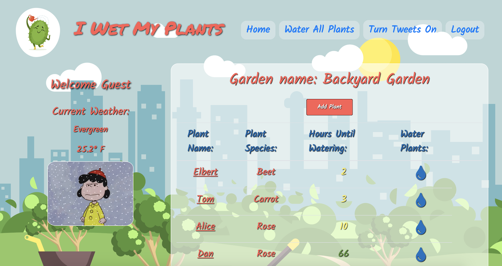

# I Wet My Plants
An app that can be [found here](https://i-wet-my-plants.herokuapp.com) to help you track when to water plants in your garden. With many features it will become a staple to your summer gardening routine. Features:

* Track when you need to water plants and your watering history 
* Uses [Dark Sky API](https://darksky.net/dev) for real time updates on when to water based on weather forecasts for rain
* Facebook OAuth login
* Optional tweets sent to you from [our twitter account](https://twitter.com/iwetmyplants3) when your plants need watering
* [Site API](http://i-wet-my-plants.herokuapp.com/api/v1) for the option to have hardware track when plants need water, and then update water status after watering



## Prerequisites

You will need Ruby version 2.4 or greater and Rails version 5.2.

To check your version using the terminal, run: `rails -v`.
If you have not installed rails, in terminal, run: `gem install rails -v 5.2`.

## Getting Started

To setup on a local machine please find an appropriate directory and clone down the repo and then run the initial setup using the following commands. Note: it uses Ruby version 2.4.1 and Rails version 5.2.2.


```
git clone https://github.com/jpclark6/i-wet-my-plants
cd i-wet-my-plants
bundle
rake db:{create,migrate,seed}
```

You will also need the following environmental variables sorted in `config/application.yml`. These can be found for free but must be kept private and will not be included.

```
GOOGLE_API_KEY: < used for geoservice >
DARK_SKY_API_KEY: < for weather updates >
FACEBOOK_SECRET: < OAuth >
FACEBOOK_KEY: < OAuth >
TWITTER_API: < for tweeting >
TWITTER_SECRET_API: < for tweeting >
TWITTER_ACCESS_TOKEN: < for tweeting >
TWITTER_ACCESS_SECRET: < for tweeting >
HARDWARE_SECRET_API: < for hardware API, any value will work >
```
Once these are ready you can run the server:
```
rails s
```
Navigate to `localhost:3000`. The application will load to the page. Enjoy!

## Testing

Our testing suite uses the following tools:

* [RSpec](https://github.com/rspec/rspec-rails)
* [Capybara](https://github.com/teamcapybara/capybara)
* [SimpleCov](https://github.com/colszowka/simplecov)
* [Factory Bot Rails](https://github.com/thoughtbot/factory_bot_rails)
* [VCR](https://github.com/vcr/vcr)
* [Webmock](https://github.com/bblimke/webmock)
* [Faker](https://github.com/stympy/faker)
* [Launchy](https://github.com/copiousfreetime/launchy)
* [Shoulda Matchers](https://github.com/thoughtbot/shoulda-matchers)

Note: Before running RSpec, ensure you're in the project root directory (`i-wet-my-plants`). Testing includes unit and feature tests made with RSpec, 

To run the full testing suite run this command from the terminal:
```
rspec
```

After RSpec has completed, you should see all tests passing as GREEN. Any tests that have failed or thrown an error will display RED. Any tests that have been skipped will be displayed as YELLOW.


### Feature Tests

Feature tests are tests that check content in the page at a view level. Capybara was utilized to make assertions. FactoryBot was utilized to create test objects. The following are examples of such:

```
require "rails_helper"

describe 'as a registered user' do
  it 'can water all plants plant', :vcr do
    yesterday = 1.day.ago
    two_days_ago = 2.days.ago
    user_1 = create(:user)
    garden = create(:garden, user: user_1)
    plant_1 = create(:plant, garden: garden, frequency: 24, last_watered: yesterday)
    plant_2 = create(:plant, garden: garden, frequency: 12, last_watered: yesterday)
    plant_3 = create(:plant, garden: garden, frequency: 18, last_watered: two_days_ago)
    allow_any_instance_of(ApplicationController).to receive(:current_user).and_return(user_1)

    visit '/plants'

    click_on "Water All Plants"

    expect(current_path).to eq(plants_path)
    within "#plant-#{plant_1.id}" do
      plant = Plant.find(plant_1.id)
      expect(plant.hours_until_watering).to eq(24)
      expect(plant.hours_since_watered).to eq(0)
      expect(page).to have_content(plant.hours_until_watering)
    end
    within "#plant-#{plant_2.id}" do
      plant = Plant.find(plant_2.id)
      expect(plant.hours_until_watering).to eq(12)
      expect(plant.hours_since_watered).to eq(0)
      expect(page).to have_content(plant.hours_until_watering)
    end
    within "#plant-#{plant_3.id}" do
      plant = Plant.find(plant_3.id)
      expect(plant.hours_until_watering).to eq(18)
      expect(plant.hours_since_watered).to eq(0)
      expect(page).to have_content(plant.hours_until_watering)
    end
  end
end
```

### Model Tests

I Wet My Plants has 100% coverage on all model testing. Validation and relationship testing was also included in the application. The following is an example of a model test that was utilized:

```
require 'rails_helper'

describe Garden do
  describe 'validations' do
    it { should validate_presence_of(:name) }
    it { should validate_presence_of(:twitter_handle) }
    it { should validate_presence_of(:zip_code) }
  end
  describe 'relationships' do
    it { should belong_to(:user) }
    it { should have_many(:plants) }
  end
  describe 'instance methods' do
    it '.plants_by_water_need' do
      user_1 = create(:user)
      garden = create(:garden)
      plant_1 = create(:plant, name: 'Alice', species: 'Rose', frequency: 24, last_watered: Time.now, garden: garden)
      plant_2 = create(:plant, name: 'Tom', species: 'Carrot', frequency: 12, last_watered: Time.now, garden: garden)
      plant_3 = create(:plant, name: 'Elbert', species: 'Beet', frequency: 18, last_watered: Time.now, garden: garden)
      expect(garden.plants_by_water_need).to eq([plant_2, plant_3, plant_1])
    end
    it '.plants_that_need_water' do
      user_1 = create(:user)
      garden = create(:garden)
      plant_1 = create(:plant, name: 'Alice', species: 'Rose', frequency: 24, last_watered: 2.days.ago, garden: garden)
      plant_2 = create(:plant, name: 'Tom', species: 'Carrot', frequency: 5, last_watered: Time.now, garden: garden)
      plant_3 = create(:plant, name: 'Elbert', species: 'Beet', frequency: 7, last_watered: Time.now, garden: garden)
      expect(garden.plants_that_need_water).to eq([plant_1, plant_2])
    end
    it '.plants_that_need_water_api' do
      user_1 = create(:user)
      garden = create(:garden)
      plant_1 = create(:plant, name: 'Alice', species: 'Rose', frequency: 24, last_watered: 2.days.ago, garden: garden)
      plant_2 = create(:plant, name: 'Tom', species: 'Carrot', frequency: 5, last_watered: Time.now, garden: garden)
      plant_3 = create(:plant, name: 'Elbert', species: 'Beet', frequency: 7, last_watered: Time.now, garden: garden)
      expect(garden.plants_that_need_water_api).to eq([plant_1])
    end
  end
end
```

## Deployment


['I Wet My Plants' is currently deployed here on Heroku](https://i-wet-my-plants.herokuapp.com/).

You can also run it in production on your own server by following these steps:

1. Have all prequisites installed (postrgres, pum, the pg gem)
2. In your terminal, in your i-wet-my-plants directory, run:
```
 $ createuser -s -r i-wet-my-plants
 $ RAILS_ENV=production rake db:{drop,create,migrate,seed}
 $ rake assets:precompile
 $ rails s -e production
 ```

## Additional Tools Utilized

* Rails
* PostrgeSQL
* [Waffle.io](https://waffle.io)
* [GitHub](github.com)
* [Pry](https://github.com/pry/pry)
* Chrome dev tools

## Developers

* **Justin Clark** - [jpclark6](https://github.com/jpclark6)
* **Justin Mauldin** - [justinmauldin7](https://github.com/justinmauldin7)
* **Daniel Briechle** - [danbriechle](https://github.com/danbriechle)
* **Maddie Jones** - [maddyg91](https://github.com/maddyg91)

## Acknowledgments

* **Michael Dao** - [mikedao](https://github.com/mikedao)
* **Sal Espinosa** - [s-espinosa](https://github.com/s-espinosa)
